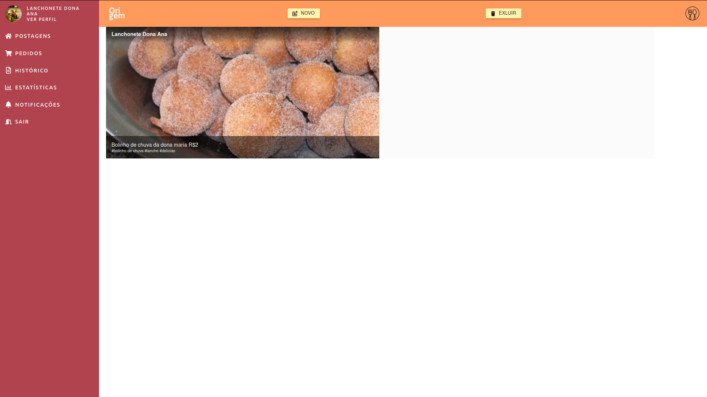

<p align="center">
    <a href=><a/>
</p>
    <h1 align="center">Origin</h1>

<h4 align="center">
Entcontre os melhores preços de comidas perto de você</h4>
<p align="center">
  

  
  
  <a href="https://github.com/KZTN/MegaHack_frontend/commits/master">
    
  </a>

  <a href="https://github.com/KZTN/MegaHack_frontend/issues">
    
  </a>

  
</p>
<p align="center">
  
</p>

## ⚠️ Atenção

 Este é um projeto com a iniciativa do hackathon da Shawee MegaHack 3.0. Todo o protótipo está funcional e pronto para uso.

## 💻 Projeto

O Origin é uma plataforma que une o planejamento de negócio voltado para apoio do empreendedo com suas vendas e uma relação mais próxima com seu cliente.

## Começando...
Essas instruções fornecerão uma cópia do projeto em execução na sua máquina local para fins de desenvolvimento e teste.

### Pré-requisitos
O que você precisa para instalar o software:

```
node v12.x
yarn 1.22.4
git
```

### Instalando o projeto 🚀
Clonando o projeto:

```
git clone https://github.com/KZTN/MegaHack_frontend.git
```

Navegando até a pasta do projeto:

```
cd MegaHack_frontend
```

Baixando as dependências do projeto:

```bash
yarn install
```

Rodando o projeto:

```bash
yarn start
```


Visite http://localhost:3000 com o seu navegador para ver o resultado. 🎉


## 📄 Documentação 
<ul>
   <li><a href="https://ogirin-docs.vercel.app/" target="_blank">Versão unificada</a></li>
</ul>


# 🧪 Tenologias utilizadas: 

 - [React](https://reactjs.org/docs/getting-started.html) - Framework javascript
 - [Typescript](https://devdocs.io/javascript/) - Linguagem de programação
 - [axios](https://github.com/badunk/multer-s3#readme) - Requisitor de chamadas API da aplicação


## :memo: Licença

Esse projeto está sob a licença MIT. Veja o arquivo [LICENSE](LICENSE.md) para mais detalhes.

## Como contribuir

- Faça um fork desse repositório;
- Cria uma branch com a sua feature: `git checkout -b minha-feature`;
- Faça commit das suas alterações: `git commit -m 'feat: Minha nova feature'`;
- Faça push para a sua branch: `git push origin minha-feature`.

Depois que o merge da sua pull request for feito, você pode deletar a sua branch.
